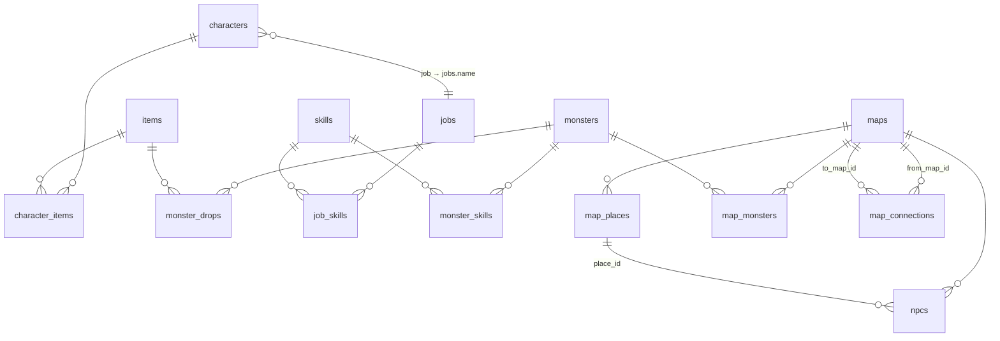

# Modelo de dados

O banco é um SQLite (`backend/ragnarokcs.db`, ignorado pelo git) acessado com SQLAlchemy assíncrono (`aiosqlite`). Todos os modelos herdam de `DBBaseModel` (`backend/core/config.py`) e ficam em `backend/models/`.

## Diagrama


```mermaid
erDiagram
    characters }o--|| jobs : "job → jobs.name"
    characters ||--o{ character_items : ""
    items ||--o{ character_items : ""
    monsters ||--o{ monster_drops : ""
    items ||--o{ monster_drops : ""
    jobs ||--o{ job_skills : ""
    skills ||--o{ job_skills : ""
    monsters ||--o{ monster_skills : ""
    skills ||--o{ monster_skills : ""
    maps ||--o{ npcs : ""
    maps ||--o{ map_places : ""
    map_places ||--o{ npcs : "place_id"
    maps ||--o{ map_monsters : ""
    monsters ||--o{ map_monsters : ""
    maps ||--o{ map_connections : "from_map_id"
    maps ||--o{ map_connections : "to_map_id"
```

## Tabelas

### `characters`: `CharacterModel` (`models/character_model.py`)

| Coluna | Tipo | Padrão | Observação |
|---|---|---|---|
| `id` | Integer PK | autoincremento | |
| `name` | String(255) | n/a | obrigatório |
| `job` | String(255), FK `jobs.name` | `"Novice"` | |
| `level` | Integer | 1 | |
| `exp` | Integer | 0 | EXP **total** acumulada; o nível sai dela (ver [Progressão de level](progressao-de-level.md)) |
| `hp` / `max_hp` | Integer | 50 / 50 | HP do herói na batalha |
| `max_sp` | Integer | 10 | ainda não usado no jogo |
| `zeny` | Integer | 0 | inteiro, sem casas decimais; bancos antigos (`Numeric(10, 2)`) são arredondados pelo seed |
| `current_map` | String | `"Novice Island"` | nome do mapa (texto duplicado) |
| `current_map_id` | String | `"novice_academy"` | id do mapa; não é FK |

### `items`: `ItemModel` (`models/items_model.py`)

Catálogo de itens do jogo (ver [Inventário](inventario.md)).

| Coluna | Tipo | Observação |
|---|---|---|
| `id` | String(64) PK | ex.: `jellopy` |
| `name` | String(255) | |
| `type` | String(30) | `Misc` por enquanto; depois Helmet, Armor, Cape, Boots, Sword, Rod, Axe… |
| `description` | String | aparece no pop up de detalhes |
| `drop_rate` | Float | chance de drop em porcentagem (70 = 70%); cartas usam 0,2 |
| `icon` | String, nulo | ícone da bolsa, `items/<id>/icon.png` |
| `collection` | String, nulo | imagem dos detalhes, `items/<id>/collection.png` |

### `character_items`: `CharacterItemModel` (`models/character_item_model.py`)

Itens que cada personagem carrega. Único por (`character_id`, `slot`).

| Coluna | Tipo | Observação |
|---|---|---|
| `id` | Integer PK | |
| `character_id` | Integer, FK `characters.id` | apagado junto com o personagem |
| `item_id` | String(64), FK `items.id` | |
| `slot` | String(30) | `bag_0`…`bag_39` ou um slot de equipamento (`head`, `armor`, `right_hand`, `left_hand`, `garment`, `shoes`, `accessory_1`, `accessory_2`) |
| `amount` | Integer | quantidade da pilha (itens Misc se empilham; equipamentos ficam 1 por slot) |

### `monster_drops`: `MonsterDropModel` (`models/monster_drop_model.py`)

Quais itens cada monstro dropa. PK (`monster_id`, `item_id`). A chance é a `drop_rate` do item. Ver [Inventário](inventario.md#drops).

### `jobs`: `JobModel` (`models/jobs_model.py`)

Dados de batalha comuns a todos os personagens de um job.

| Coluna | Tipo | Observação |
|---|---|---|
| `name` | String PK | ex.: `"Novice"`; é o valor de `characters.job` |
| `sheet` | String | pasta em `assets/sprites/characters/<sheet>/` |
| `avatar` | String | imagem do card da unidade na batalha |
| `max_ap` | Integer | pontos de ação por turno |
| `offset_x`, `offset_y` | Integer | ajuste fino da posição do sprite no tile |

Relação: `skill_links` → `JobSkillModel`, ordenado por `slot`.

### `skills`: `SkillModel` (`models/skills_model.py`)

| Coluna | Tipo | Observação |
|---|---|---|
| `id` | Integer PK | |
| `name` | String, único | chave usada no frontend (`state.skills[name]`) |
| `ap_cost` | Integer | custo em AP |
| `damage` | Integer | dano fixo |
| `range` | Integer | alcance em tiles (linha reta) |
| `icon` | String | ícone em `assets/` |

### `job_skills`: `JobSkillModel` / `monster_skills`: `MonsterSkillModel`

Tabelas de ligação N:N com uma coluna `slot` para a ordem:

- `job_skills(job_name, skill_id, slot)`: `slot` é a ordem na barra de skills do jogador.
- `monster_skills(monster_id, skill_id, slot)`: `slot` 0 é a skill principal da IA (`battle_ai._main_skill` usa `unit["skills"][0]`).

Ambas têm `skill = relationship("SkillModel", lazy="selectin")`.

### `monsters`: `MonsterModel` (`models/monsters_model.py`)

| Coluna | Tipo | Padrão | Observação |
|---|---|---|---|
| `id` | Integer PK | | |
| `name` | String(255), único | | |
| `sheet` | String, obrigatório | | pasta em `assets/sprites/monsters/`: sprite da batalha e figura do monstro no mapa e no card da batalha (clip `idle_sw`) |
| `level` | Integer | 1 | nível do monstro |
| `base_exp` | Integer | 0 | EXP base por abate (ver [Regra de experiência](regra-de-experiencia.md)) |
| `max_hp` | Integer | 50 | |
| `max_ap` | Integer | 2 | |
| `ai` | String(50) | `"passive"` | nome de um comportamento em `battle_ai.BEHAVIORS` |
| `offset_x`, `offset_y` | Integer | 0 | |

Relação: `skill_links` → `MonsterSkillModel`, ordenado por `slot`.

### `maps`: `MapModel` (`models/maps_model.py`)

| Coluna | Tipo | Observação |
|---|---|---|
| `id` | String PK | ex.: `"training_field_1"`; vira a rota `/map/training_field_1` |
| `name` | String(255) | |
| `level_range` | String(30) | texto livre, ex.: `"1 - 10"`; vazio (`""`) em prédios: a tela não mostra o nível recomendado nem o "Lv" em Routes |
| `town_image` | String, opcional | o mapa da cidade onde ficam os marcadores (4:3), direto em `assets/maps/`; `NULL` = a tela mostra um quadrado vazio |
| `background_image` | String, opcional | a imagem de fundo da tela do mapa (fica a 15% de opacidade atrás do conteúdo), em `assets/maps/backgrounds/`; `NULL` = só a cor de fundo |
| `about` | Text | descrição, ainda não exibida |
| `parent_map_id` | String, opcional (FK `maps.id`) | só em prédios: o mapa em que ele fica (ex.: `academy` → `novice_academy`). A tela mostra o nome desse mapa (com ícone de localização) sob o título e a viagem de ida e volta é instantânea |
| `zone` | String(30) | `"safe"`, `"hostile_passive"` ou `"hostile_aggressive"`; só `"safe"` tem indicação ("Safe Zone" no topo da tela do mapa e nas rotas que levam a ele); as outras zonas não mostram nada |

Relações (todas `lazy="selectin"`): `npcs`, `places` (ordenados por `slot`), `monster_spawns`, `connections`.

### `map_places`: `MapPlaceModel` (`models/map_place_model.py`)

Pontos de interesse desenhados como marcadores sobre o mapa da cidade (`maps.town_image`).

| Coluna | Tipo | Observação |
|---|---|---|
| `id` | Integer PK | |
| `map_id` | FK `maps.id` | mapa onde o lugar fica |
| `name` | String(255) | pode repetir (ex.: duas "House") |
| `kind` | String(20) | `"area"` (tem NPCs), `"building"` (prédio; entrar vem depois) ou `"exit"` (leva a outro mapa) |
| `icon` | String(50) | chave do ícone; o frontend traduz em `PLACE_ICONS` |
| `x`, `y` | Float | centro do marcador, em fração (0–1) da largura/altura do mapa da cidade |
| `slot` | Integer | ordem de exibição |
| `direction` | String(30), nullable | saídas: direção, ex.: `"Northwest"` |
| `target_map_id` | FK `maps.id`, nullable | saídas: mapa de destino (relação `target_map`) |

### `npcs`: `NpcModel` (`models/npcs_model.py`)

`id`, `map_id` (FK `maps.id`), `name`, `image`, `place_id` (FK `map_places.id`, a área onde o NPC fica) e `greeting` (fala base mostrada no card do NPC). Cada NPC pertence a um único mapa.

### `map_monsters`: `MapMonsterModel` (`models/map_monster_model.py`)

Liga monstros a mapas: `map_id` + `monster_id` (PK composta) e `spawn_rate`, a chance do monstro (peso do sorteio) cada vez que a caçada sorteia monstros; também é mostrado no card do monstro no mapa. Relação `monster` → `MonsterModel`.

### `map_connections`: `MapConnectionModel` (`models/map_connection_model.py`)

Arestas **direcionais** do grafo de navegação: `from_map_id` → `to_map_id`. Para ir e voltar entre dois mapas são precisas duas linhas. Relação `to_map` → `MapModel`.

## Registro dos modelos

`backend/models/__all_models.py` importa **todos** os modelos. Isso é necessário para que `DBBaseModel.metadata.create_all` conheça todas as tabelas. `main.py`, `create_tables.py` e `seed_data.py` importam esse arquivo. **Ao criar um modelo novo, adicione o import lá.**

## Dados do jogo: `backend/seed_data.py`

Não existe painel de administração: os dados do jogo são declarados em dicionários Python e gravados por `seed()`.

| Dicionário | Conteúdo atual |
|---|---|
| `ITEMS` | `jellopy` (70%), `empty_bottle` (15%), `apple` (2%), `poring_card` (0,2%), todos Misc |
| `SKILLS` | `Basic Attack` (1 AP, 10 de dano, alcance 1) |
| `JOBS` | `Novice` (sheet `novice`, 5 AP, skill `Basic Attack`) |
| `MONSTERS` | `Poring`, `Lunatic` e `Wilow` (50 HP, 2 AP, `Basic Attack`, IA `approach_and_attack`) |
| `MAPS` | `novice_academy` (2 NPCs, sem monstros) e `training_field_1` (1 NPC, 3 monstros); um conectado ao outro |

Ordem de execução de `seed()`:

1. Cria as tabelas que não existem (`create_all`).
2. **Itens**: cria ou atualiza por id (upsert); os que saíram de `ITEMS` são apagados, inclusive das bolsas. Um banco com a tabela `items` antiga (colunas `kind`/`equip_type`) tem essa tabela e os itens dos personagens apagados antes do `create_all`.
3. **Skills**: cria ou atualiza por nome (upsert).
4. **Jobs**: cria ou atualiza; apaga e regrava os vínculos em `job_skills`.
5. **Monstros**: cria ou atualiza por nome; apaga e regrava os vínculos em `monster_skills` e os drops em `monster_drops` (lista `drops` do monstro).
6. **Mapas**: se o mapa **já existe**, só atualiza nome, faixa de nível, imagem, `town_image`, descrição e `zone`. Os spawns **não** são reinseridos nem atualizados. Se não existe, cria com os spawns.
7. **Lugares e NPCs**: apaga e regrava, a cada execução, os lugares (`map_places`) e os NPCs de cada mapa. O NPC aponta para a área pelo nome (precisa ser única entre as áreas do mapa).
8. **Conexões**: cria as que ainda não existem.
9. **Personagens**: o nível segue a EXP total, o nome do mapa atual é sincronizado.

O script é **idempotente**: pode rodar várias vezes sem duplicar dados.

`upsert(instance, values)` é o helper que copia os campos de um dict para a instância.

### Como adicionar conteúdo

- **Monstro caçável novo**: gere a sprite sheet (ver [Sprites e animação](sprites-e-animacao.md)); adicione a entrada em `MONSTERS` com `image`, `sheet`, `max_hp`, `max_ap`, `ai`, `skills`; inclua `("Nome", peso)` na lista `monsters` do mapa.
- **Skill nova**: adicione em `SKILLS` e referencie pelo nome em `JOBS[...]["skills"]` ou `MONSTERS[...]["skills"]`.
- **Mapa novo**: adicione em `MAPS` com `zone`, `places` (com uma saída `exit` para cada mapa vizinho), `npcs` e `navigation` nos dois sentidos, e, se houver, coloque o mapa da cidade em `assets/maps/` e aponte o `town_image` para ele (4:3, ex.: 1440 × 1080; sem `town_image` a tela mostra um quadrado vazio). Não existe mais arte de capa. O fundo da tela vem de `background_image` (`assets/maps/backgrounds/`; vários mapas podem usar o mesmo arquivo). As coordenadas `x`/`y` dos lugares são relativas ao `town_image`. Reinicie o frontend para registrar a rota nova.
- **Lugar ou NPC novo**: edite `places`/`npcs` do mapa e rode o seed; eles são regravados a cada execução.

> Limitação: **mudar os spawns de um mapa que já está no banco não tem efeito** ao rodar o seed de novo. Nesse caso é preciso apagar o banco e recriar.

## Mudanças de schema

Não há migrações (Alembic ou similar). `create_all` cria tabelas novas, mas **não altera tabelas existentes** (colunas novas não aparecem). O caminho documentado é:

```bash
cd backend && rm ragnarokcs.db && python seed_data.py
```

Isso apaga também os personagens criados. Para preservá-los, a alternativa é aplicar `ALTER TABLE ... ADD COLUMN` manualmente antes de rodar o seed.
